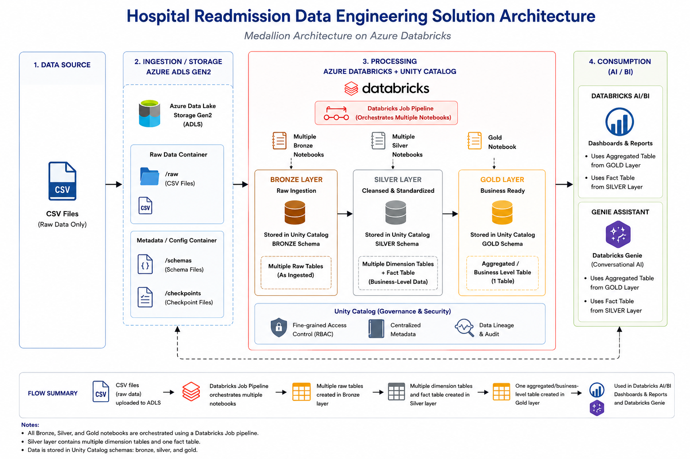
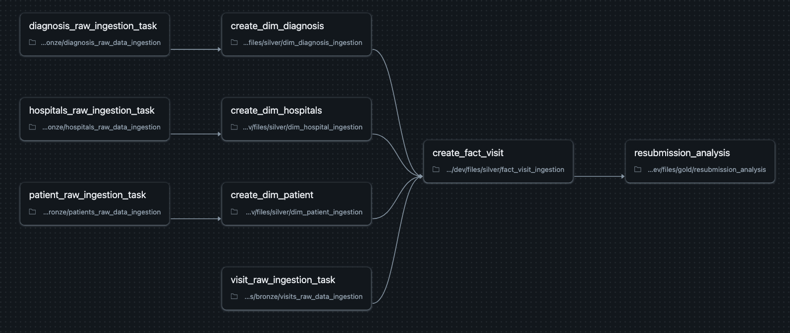
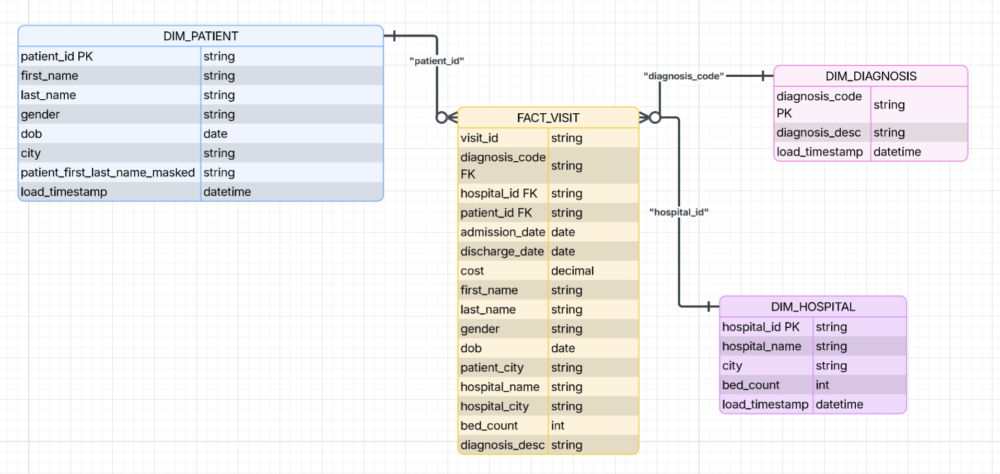
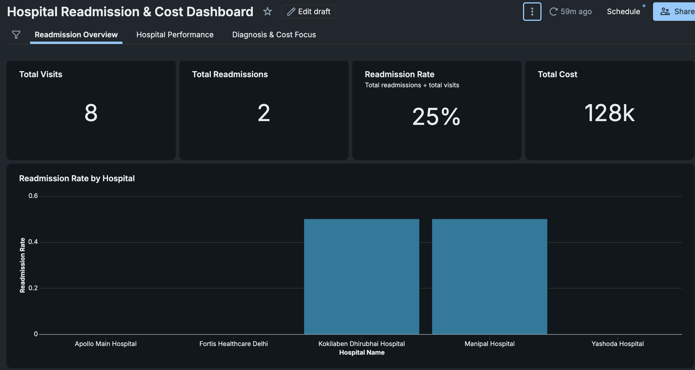
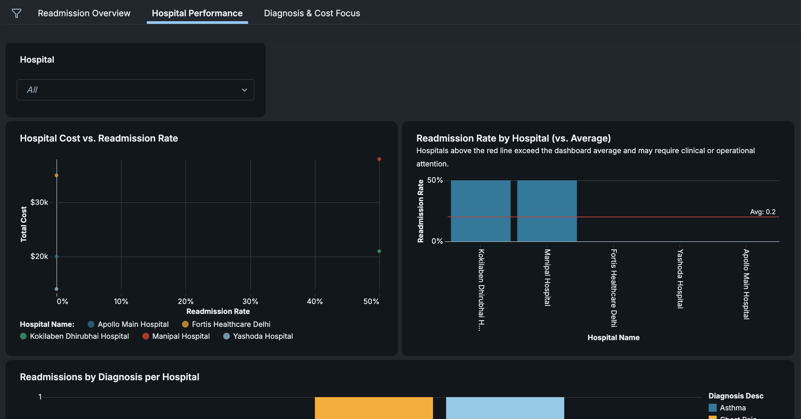
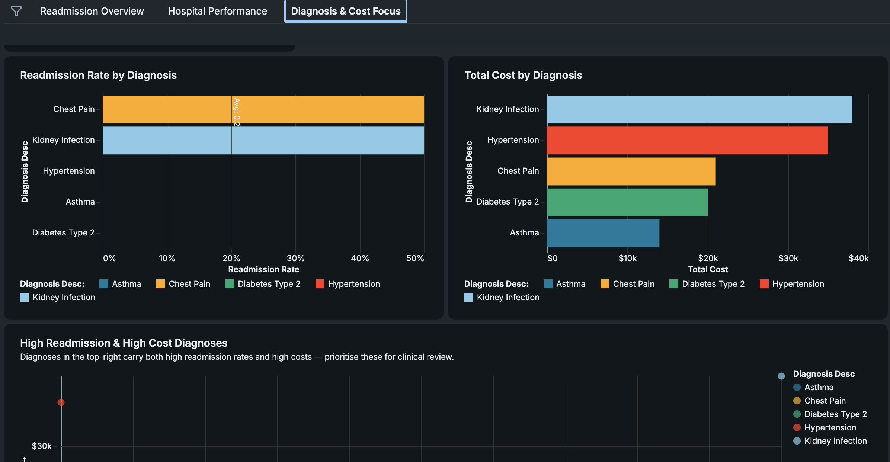

# Azure Databricks Hospital Readmissions Data Engineering Project

## 📌 Project Overview

This project implements a fully automated data pipeline and reporting solution to analyze **hospital readmission trends** across a multi-centre hospital chain.

### 🧩 Problem

Hospitals are experiencing a growing number of **patient readmissions within 30 days of discharge**, which:

* Reduces reimbursement or leads to financial penalties
* Limits bed availability
* Impacts patient trust and care quality

### ⚙️ Solution

This pipeline:

* Ingests **EHR data (CSV files)** from Azure Data Lake Storage (ADLS)
* Transforms data using **Databricks and Medallion Architecture (Bronze → Silver → Gold)**
* Builds **fact and dimension tables** for analytics
* Produces an aggregated dataset for reporting
* Supports **incremental data loading**
* Uses **CI/CD pipelines** to automatically deploy and run workflows across environments

### 💼 Business Value

* Identifies **hospitals and diagnoses driving high readmissions**
* Highlights **cost-heavy problem areas**
* Enables targeted interventions to reduce:

  * Financial losses
  * Bed shortages
  * Patient dissatisfaction

---

## 🛠️ Tech Stack

* **Azure Data Lake Storage (ADLS)**
* **Azure Databricks**

  * Lakeflow Jobs
  * AI/BI Dashboard
  * Genie Agent
  * Databricks Asset Bundles
* **GitHub & GitHub Actions (CI/CD)**

---

## 🏗️ Architecture

### Overview

* Raw **diagnosis, patient, hospital, and visit data** stored in ADLS
* **Bronze Layer**: Raw ingestion using Autoloader → Delta tables
* **Silver Layer**: Data cleansing, deduplication, enrichment → fact & dimension tables
* **Gold Layer**: Aggregated KPI table for analytics

Outputs:

* **Fact Table** → detailed analysis
* **Summary Table** → reporting layer
* Integrated with:

  * **AI/BI Dashboard** (visual insights)
  * **Genie Agent** (natural language querying)

---

## 🔄 Data Pipeline Design

### 🥉 Bronze Layer

* Ingests raw CSV files from ADLS
* Uses **Databricks Autoloader** for incremental loading
* Writes to Delta tables using streaming (`append`, `availableNow=True`)
* Minimal transformation (drops `_rescued_data` column)

---

### 🥈 Silver Layer

**General:**

* Reads from Bronze using streaming
* Removes duplicates (based on ID)
* Adds `load_timestamp`
* Performs **upserts (merge logic)**
* Writes streaming tables (`mode = update`)

**Transformations:**

* **Patient Table**: Masks sensitive data (names)
* **Visit Fact Table**:

  * Joins patient, hospital, and diagnosis data
  * Standardizes column names
  * Converts date formats

---

### 🥇 Gold Layer

* Builds analytics-ready dataset from fact table
* Derives:

  * Previous discharge date
  * Days since last visit
  * **30-day readmission flag**
* Creates aggregated KPI table:

  * Total visits
  * Total readmissions
  * Readmission rate
  * Total cost
  * Average cost

---

## 🧠 Key Engineering Highlights

* ✅ Incremental ingestion with **Databricks Autoloader**
* ✅ **Medallion architecture** (Bronze, Silver, Gold)
* ✅ **Streaming pipelines** with `availableNow` trigger
* ✅ **Star schema** for analytics optimization
* ✅ **CI/CD pipelines** using GitHub Actions
* ✅ Fully automated **end-to-end data pipeline**
* ✅ Data masking for **sensitive patient information**

---

## 📊 Data Model

### Schema Design

A **star schema** was implemented for optimized analytical performance.

**Tables:**

* `dim_diagnosis`
* `dim_patient`
* `dim_hospital`
* `fact_visit`
* `hospital_disease_kpi` (aggregated table)

---

## 📈 Reporting (Dashboard)

### 📍 Page 1: Readmission Overview

**Purpose:** High-level performance across hospitals and diagnoses

**Metrics:**

* Total visits
* Total readmissions
* Readmission rate
* Total cost

**Visuals:**

* Readmission Rate by Hospital
* Top Diagnoses by Readmissions
* Cost vs Readmission Rate

---

### 📍 Page 2: Hospital Performance

**Purpose:** Compare hospital-level performance

**Visuals:**

* Hospital Cost vs Readmission Rate
* Readmission Rate vs Average
* Readmissions by Diagnosis per Hospital

---

### 📍 Page 3: Diagnosis & Cost Focus

**Purpose:** Identify high-risk, high-cost diagnoses

**Visuals:**

* Readmission Rate by Diagnosis
* Total Cost by Diagnosis
* High Readmission & High Cost Diagnoses

---

## 🔐 Security

* Secure connection via **Access Connector for Azure Databricks (Unity Catalog)**
* Role-based access control (RBAC) applied to ADLS
* External locations configured with **storage credentials**
* Sensitive data (patient names) masked in transformation layer

---

## ⚙️ Orchestration

* **Databricks Lakeflow Jobs** used for pipeline orchestration
* Pipelines triggered automatically via **GitHub Actions**:

  * `dev` branch → deploys to Dev environment
  * `main` branch → deploys to Prod environment

---

## 🚀 Summary

This project demonstrates a **production-style data engineering pipeline** using Azure Databricks, showcasing:

* Scalable data ingestion
* Structured transformation layers
* Automated orchestration
* CI/CD integration
* Business-focused analytics

